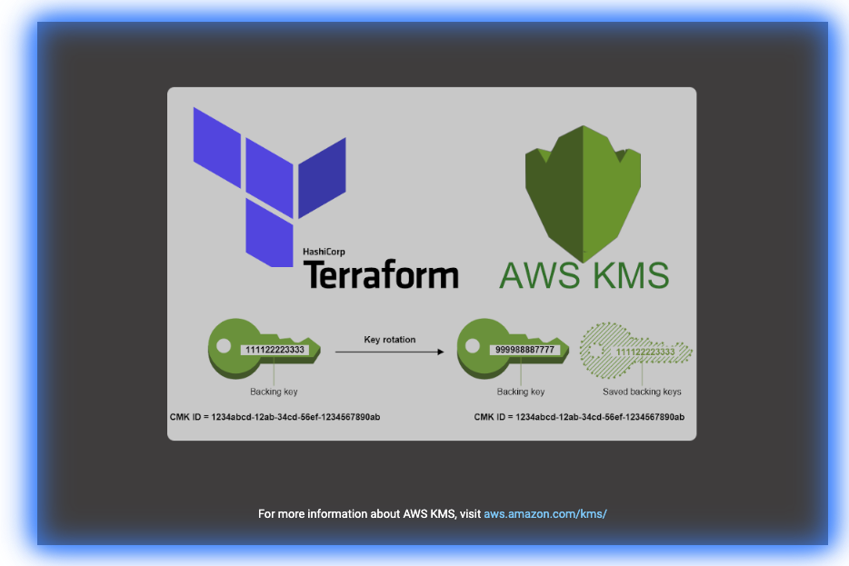

# Terrafrom KMS Key Module

  

<br>

## Getting Started

This Terraform module is designed to produce a secure AWS Key Management Service (KMS) Customer Managed Key (CMK) that can be used for server side encryption on AWS services such as S3 buckets, EBS volumes, Dynamo DB Tables, or any other service where data that requires encryption is stored. This module was created with dynamic options that allow the consumer of the module to determine project by project what KMS Key polices should be placed on the KMS key at the time of provisioning.

<br>

## Module Pre-Requisites

None Defined

<br>

## Module Usage

```terraform
module "kms" {
  source = "git@github.com:CloudMage-TF/AWS-KMS-Module?ref=v1.0.0"

  // Required
  kms_key_description       = "KMS key provisioned to encrypt prod s3 bucket"
  kms_key_alias_name        = "prod/s3"
  
  // Optional
  kms_admin_principal_list    = ["arn:aws:iam::123456789101:role/AWS-KMS-Admin-Role"]
  kms_user_principal_list     = ["arn:aws:iam::123456789101:user/daboss"]
  kms_resource_principal_list = ["arn:aws:iam::123456789101:role/authapp1"]
}
```

<br>

## Variables

The following variables are utilized by this module and cause the module to behave dynamically based upon the variables that are populated and passed into the module.

<br>

###  kms_key_description

-----

This variable should be passed containing the description of the KMS key being provisioned.

<br>

```terraform
variable "kms_key_description" {
  type        = string
  description = "The description that will be applied to the provisioned KMS Key."
}
```

<br>

__EXAMPLE__: Include the following in your environments tfvars file

```terraform
kms_key_description = "KMS CMK used for encrypting all objects in the RDS Backup bucket."
```

<br><br>

###  kms_key_alias_name

-----

 This variable should be passed containing desired alias of the requested KMS Key.

<br>

> The required `alias/` prefix is already defined in the module and not required as part of the variable string.

```terraform
variable "kms_key_alias_name" {
  type        = string
  description = "The alias that will be used to reference the provisioned KMS Key. This value will be appended to alias/ in the module."
}
```

<br>

__EXAMPLE__: Include the following in your environments tfvars file

```terraform
kms_key_alias_name = "rds/backup_bucket"
```

<br>

Without defining any additional variables a key policy with the following permissions will be created and applied to the requested KMS key:

```yaml
Statement:
  - Sid: "KMSKeyOwnerPolicy"
    Effect: Allow
    Principal:
      AWS:
        - "arn:aws:iam::123456789101:root"
      Action:
        - "kms:*"
      Resources: "*"
```

<br><br>

`terraform plan`

```terraform
Refreshing Terraform state in-memory prior to plan...
The refreshed state will be used to calculate this plan, but will not be
persisted to local or remote state storage.

data.aws_caller_identity.current: Refreshing state...
data.aws_iam_policy_document.kms_user_policy: Refreshing state...
data.aws_iam_policy_document.kms_admin_policy: Refreshing state...
data.aws_iam_policy_document.kms_resource_policy: Refreshing state...
data.aws_iam_policy_document.kms_owner_policy: Refreshing state...
data.aws_iam_policy_document.temp_kms_owner_kms_admin_merge_policy: Refreshing state...
data.aws_iam_policy_document.temp_kms_admin_kms_user_merge_policy: Refreshing state...
data.aws_iam_policy_document.this: Refreshing state...

------------------------------------------------------------------------

An execution plan has been generated and is shown below.
Resource actions are indicated with the following symbols:
  + create

Terraform will perform the following actions:

  # aws_kms_alias.this will be created
  + resource "aws_kms_alias" "this" {
      + arn            = (known after apply)
      + id             = (known after apply)
      + name           = "alias/rds/backup_bucket"
      + target_key_arn = (known after apply)
      + target_key_id  = (known after apply)
    }

  # aws_kms_key.this will be created
  + resource "aws_kms_key" "this" {
      + arn                     = (known after apply)
      + deletion_window_in_days = 30
      + description             = "KMS Key"
      + enable_key_rotation     = true
      + id                      = (known after apply)
      + is_enabled              = true
      + key_id                  = (known after apply)
      + key_usage               = (known after apply)
      + policy                  = jsonencode(
            {
              + Statement = [
                  + {
                      + Action    = "kms:*"
                      + Effect    = "Allow"
                      + Principal = {
                          + AWS = "arn:aws:iam::123456789101:root"
                        }
                      + Resource  = "*"
                      + Sid       = "KMSKeyOwnerPolicy"
                    },
                ]
              + Version   = "2012-10-17"
            }
        )
    }

Plan: 2 to add, 0 to change, 0 to destroy.

------------------------------------------------------------------------

Note: You didn't specify an "-out" parameter to save this plan, so Terraform
can't guarantee that exactly these actions will be performed if
"terraform apply" is subsequently run.
```

<br><br>

###  kms_admin_principal_list

-----

This variable is used to define a list of users/roles that will be added to the KMS Key Administrator policy statement. If a list of roles/user, including a list of a single role/user is defined, then the KMS Key Administrator policy will be included in the returned KMS Key applied permissions policy.

If this variable is left empty then the KMS Key administrator policy **will not be included** into the KMS key policy. The account root owner will still have kms:* permissions, but no additional administrators will immediately be defined. IAM policies can be defined post key creation, in order to grant permissions including administration permissions to users/roles later by the key owner.

<br>

```terraform
variable "kms_admin_principal_list" {
  type        = list
  description = "A list of users/roles that will administrator the provisioned KMS Key."
  default     = []
}
```

<br>

__EXAMPLE__: Include the following in your environments tfvars file

```terraform
kms_admin_principal_list = ["arn:aws:iam::123456789101:role/AWS-KMS-Admin-Role", "arn:aws:iam::123456789101:user/kms_admin"]
```

<br>

> __Note:__ You can not assign an IAM group as a policy principal, only IAM users/roles are allowed as policy principles.

<br>

If a list defining any IAM users/roles is defined into the variable, a key policy with the following permissions will be created and applied to the requested KMS key:

```yaml
Statement:
  - Sid: "KMSKeyAdministrationPolicy"
    Effect: Allow
    Principal:
      AWS:
        - "arn:aws:iam::123456789101:role/AWS-KMS-Admin-Role"
        - "arn:aws:iam::123456789101:user/kms_admin"
      Action:
        - "kms:Create*"
        - "kms:Describe*"
        - "kms:Enable*"
        - "kms:List*"
        - "kms:Put*"
        - "kms:Update*"
        - "kms:Revoke*"
        - "kms:Disable*"
        - "kms:Get*"
        - "kms:Delete*"
        - "kms:TagResource"
        - "kms:UntagResource"
        - "kms:ScheduleKeyDeletion"
        - "kms:CancelKeyDeletion"
      Resources: "*"
```

<br><br>

`terraform plan -var='kms_admin_principal_list=["arn:aws:iam::123456789101:root"]`

```terraform
Refreshing Terraform state in-memory prior to plan...
The refreshed state will be used to calculate this plan, but will not be
persisted to local or remote state storage.

data.aws_caller_identity.current: Refreshing state...
data.aws_iam_policy_document.kms_user_policy: Refreshing state...
data.aws_iam_policy_document.kms_resource_policy: Refreshing state...
data.aws_iam_policy_document.kms_admin_policy: Refreshing state...
data.aws_iam_policy_document.kms_owner_policy: Refreshing state...
data.aws_iam_policy_document.temp_kms_owner_kms_admin_merge_policy: Refreshing state...
data.aws_iam_policy_document.temp_kms_admin_kms_user_merge_policy: Refreshing state...
data.aws_iam_policy_document.this: Refreshing state...

------------------------------------------------------------------------

An execution plan has been generated and is shown below.
Resource actions are indicated with the following symbols:
  + create

Terraform will perform the following actions:

  # aws_kms_alias.this will be created
  + resource "aws_kms_alias" "this" {
      + arn            = (known after apply)
      + id             = (known after apply)
      + name           = "alias/rds/backup_bucket"
      + target_key_arn = (known after apply)
      + target_key_id  = (known after apply)
    }

  # aws_kms_key.this will be created
  + resource "aws_kms_key" "this" {
      + arn                     = (known after apply)
      + deletion_window_in_days = 30
      + description             = "KMS Key"
      + enable_key_rotation     = true
      + id                      = (known after apply)
      + is_enabled              = true
      + key_id                  = (known after apply)
      + key_usage               = (known after apply)
      + policy                  = jsonencode(
            {
              + Statement = [
                  + {
                      + Action    = "kms:*"
                      + Effect    = "Allow"
                      + Principal = {
                          + AWS = "arn:aws:iam::123456789101:root"
                        }
                      + Resource  = "*"
                      + Sid       = "KMSKeyOwnerPolicy"
                    },
                  + {
                      + Action    = [
                          + "kms:Update*",
                          + "kms:UntagResource",
                          + "kms:TagResource",
                          + "kms:ScheduleKeyDeletion",
                          + "kms:Revoke*",
                          + "kms:Put*",
                          + "kms:List*",
                          + "kms:Get*",
                          + "kms:Enable*",
                          + "kms:Disable*",
                          + "kms:Describe*",
                          + "kms:Delete*",
                          + "kms:Create*",
                          + "kms:CancelKeyDeletion",
                        ]
                      + Effect    = "Allow"
                      + Principal = {
                          + AWS = "arn:aws:iam::123456789101:root"
                        }
                      + Resource  = "*"
                      + Sid       = "KMSKeyAdministrationPolicy"
                    },
                ]
              + Version   = "2012-10-17"
            }
        )
    }

Plan: 2 to add, 0 to change, 0 to destroy.

------------------------------------------------------------------------

Note: You didn't specify an "-out" parameter to save this plan, so Terraform
can't guarantee that exactly these actions will be performed if
"terraform apply" is subsequently run.
```

<br><br>

###  kms_user_principal_list

-----

This variable is used to define a list of users/roles that will be added to the KMS Key user policy statement. If a list of roles/user, including a list of a single role/user is defined, then the KMS Key user policy will be included in the returned KMS Key applied permissions policy.

If this variable is left empty then the KMS Key user policy **will not be included** into the KMS key policy. The account root owner and any defined key administrators will still have their defined permissions, but no additional users will immediately be defined. IAM policies can be defined post key creation, in order to grant permissions including users permissions to users/roles later by the key owner.

<br>

```terraform
variable "kms_user_principal_list" {
  type        = list
  description = "A list of users/roles that will be granted usage of the provisioned KMS Key."
  default     = []
}
```

<br>

__EXAMPLE__: Include the following in your environments tfvars file

```terraform
kms_user_principal_list = ["arn:aws:iam::123456789101:role/AWS-RDS-Service-Role", "arn:aws:iam::123456789101:user/rnason"]
```

<br>

> __Note:__ You can not assign an IAM group as a policy principal, only IAM users/roles are allowed as policy principles.

<br>

If a list defining any IAM users/roles is defined into the variable, a key policy with the following permissions will be created and applied to the requested KMS key:

```yaml
Statement:
  - Sid: "KMSKeyUserPolicy"
    Effect: Allow
    Principal:
      AWS:
        - "arn:aws:iam::123456789101:role/AWS-RDS-Service-Role"
        - "arn:aws:iam::123456789101:user/rnason"
      Action:
        - "kms:DescribeKey"
        - "kms:GenerateDataKey*"
        - "kms:Encrypt"
        - "kms:ReEncrypt*"
        - "kms:Decrypt"
      Resources: "*"
```

<br><br>

`terraform plan -var='kms_admin_principal_list=["arn:aws:iam::123456789101:root"]' -var='kms_user_principal_list=["arn:aws:iam::123456789101:root"]'`

```terraform
Refreshing Terraform state in-memory prior to plan...
The refreshed state will be used to calculate this plan, but will not be
persisted to local or remote state storage.

data.aws_caller_identity.current: Refreshing state...
data.aws_iam_policy_document.kms_user_policy: Refreshing state...
data.aws_iam_policy_document.kms_resource_policy: Refreshing state...
data.aws_iam_policy_document.kms_admin_policy: Refreshing state...
data.aws_iam_policy_document.kms_owner_policy: Refreshing state...
data.aws_iam_policy_document.temp_kms_owner_kms_admin_merge_policy: Refreshing state...
data.aws_iam_policy_document.temp_kms_admin_kms_user_merge_policy: Refreshing state...
data.aws_iam_policy_document.this: Refreshing state...

------------------------------------------------------------------------

An execution plan has been generated and is shown below.
Resource actions are indicated with the following symbols:
  + create

Terraform will perform the following actions:

  # aws_kms_alias.this will be created
  + resource "aws_kms_alias" "this" {
      + arn            = (known after apply)
      + id             = (known after apply)
      + name           = "alias/rds/backup_bucket"
      + target_key_arn = (known after apply)
      + target_key_id  = (known after apply)
    }

  # aws_kms_key.this will be created
  + resource "aws_kms_key" "this" {
      + arn                     = (known after apply)
      + deletion_window_in_days = 30
      + description             = "KMS Key"
      + enable_key_rotation     = true
      + id                      = (known after apply)
      + is_enabled              = true
      + key_id                  = (known after apply)
      + key_usage               = (known after apply)
      + policy                  = jsonencode(
            {
              + Statement = [
                  + {
                      + Action    = "kms:*"
                      + Effect    = "Allow"
                      + Principal = {
                          + AWS = "arn:aws:iam::123456789101:root"
                        }
                      + Resource  = "*"
                      + Sid       = "KMSKeyOwnerPolicy"
                    },
                  + {
                      + Action    = [
                          + "kms:Update*",
                          + "kms:UntagResource",
                          + "kms:TagResource",
                          + "kms:ScheduleKeyDeletion",
                          + "kms:Revoke*",
                          + "kms:Put*",
                          + "kms:List*",
                          + "kms:Get*",
                          + "kms:Enable*",
                          + "kms:Disable*",
                          + "kms:Describe*",
                          + "kms:Delete*",
                          + "kms:Create*",
                          + "kms:CancelKeyDeletion",
                        ]
                      + Effect    = "Allow"
                      + Principal = {
                          + AWS = "arn:aws:iam::123456789101:root"
                        }
                      + Resource  = "*"
                      + Sid       = "KMSKeyAdministrationPolicy"
                    },
                  + {
                      + Action    = [
                          + "kms:ReEncrypt*",
                          + "kms:GenerateDataKey*",
                          + "kms:Encrypt",
                          + "kms:DescribeKey",
                          + "kms:Decrypt",
                        ]
                      + Effect    = "Allow"
                      + Principal = {
                          + AWS = "arn:aws:iam::123456789101:root"
                        }
                      + Resource  = "*"
                      + Sid       = "KMSKeyUserPolicy"
                    },
                ]
              + Version   = "2012-10-17"
            }
        )
    }

Plan: 2 to add, 0 to change, 0 to destroy.

------------------------------------------------------------------------

Note: You didn't specify an "-out" parameter to save this plan, so Terraform
can't guarantee that exactly these actions will be performed if
"terraform apply" is subsequently run.
```

<br><br>

###  kms_resource_principal_list

-----

This variable is used to define a list of users/roles that will be added to the KMS Key resource policy statement. If a list of roles/user, including a list of a single role/user is defined, then the KMS Key resource policy will be included in the returned KMS Key applied permissions policy.

If this variable is left empty then the KMS Key resource policy **will not be included** into the KMS key policy. The account root owner, any defined key administrators, and any defined key users will still have their defined permissions, but no additional resources with grant permissions will immediately be defined. IAM policies can be defined post key creation, in order to grant permissions including resource permissions to users/roles later by the key owner.

<br>

```terraform
variable "kms_resource_principal_list" {
  type        = list
  description = "A list of users/roles that will be granted permissions to create/list/delete temporary grants to the provisioned KMS Key."
  default     = []
}
```

<br>

__EXAMPLE__: Include the following in your environments tfvars file

```terraform
kms_resource_principal_list = ["arn:aws:iam::123456789101:role/AWS-SomeAuthApp-Role"]
```

<br>

> __Note:__ You can not assign an IAM group as a policy principal, only IAM users/roles are allowed as policy principles.

<br>

If a list defining any IAM users/roles is defined into the variable, a key policy with the following permissions will be created and applied to the requested KMS key:

```yaml
Statement:
  - Sid: "KMSKeyGrantPolicy"
    Effect: Allow
    Principal:
      AWS:
        - "arn:aws:iam::123456789101:role/AWS-RDS-Service-Role"
        - "arn:aws:iam::123456789101:user/rnason"
      Action:
        - "kms:ListGrants"
        - "kms:CreateGrant"
        - "kms:RevokeGrant"
      Resources: "*"
      Condition: {
        "Bool": {
          "kms:GrantIsForAWSResource: "true"
        }
      }
```

<br><br>

`terraform plan -var='kms_admin_principal_list=["arn:aws:iam::123456789101:root"]' -var='kms_user_principal_list=["arn:aws:iam::123456789101:root"]' -var='kms_resource_principal_list=["arn:aws:iam::123456789101:root"]'`

```terraform
Refreshing Terraform state in-memory prior to plan...
The refreshed state will be used to calculate this plan, but will not be
persisted to local or remote state storage.

data.aws_caller_identity.current: Refreshing state...
data.aws_iam_policy_document.kms_user_policy: Refreshing state...
data.aws_iam_policy_document.kms_admin_policy: Refreshing state...
data.aws_iam_policy_document.kms_resource_policy: Refreshing state...
data.aws_iam_policy_document.kms_owner_policy: Refreshing state...
data.aws_iam_policy_document.temp_kms_owner_kms_admin_merge_policy: Refreshing state...
data.aws_iam_policy_document.temp_kms_admin_kms_user_merge_policy: Refreshing state...
data.aws_iam_policy_document.this: Refreshing state...

------------------------------------------------------------------------

An execution plan has been generated and is shown below.
Resource actions are indicated with the following symbols:
  + create

Terraform will perform the following actions:

  # aws_kms_alias.this will be created
  + resource "aws_kms_alias" "this" {
      + arn            = (known after apply)
      + id             = (known after apply)
      + name           = "alias/rds/backup_bucket"
      + target_key_arn = (known after apply)
      + target_key_id  = (known after apply)
    }

  # aws_kms_key.this will be created
  + resource "aws_kms_key" "this" {
      + arn                     = (known after apply)
      + deletion_window_in_days = 30
      + description             = "KMS Key"
      + enable_key_rotation     = true
      + id                      = (known after apply)
      + is_enabled              = true
      + key_id                  = (known after apply)
      + key_usage               = (known after apply)
      + policy                  = jsonencode(
            {
              + Statement = [
                  + {
                      + Action    = "kms:*"
                      + Effect    = "Allow"
                      + Principal = {
                          + AWS = "arn:aws:iam::123456789101:root"
                        }
                      + Resource  = "*"
                      + Sid       = "KMSKeyOwnerPolicy"
                    },
                  + {
                      + Action    = [
                          + "kms:Update*",
                          + "kms:UntagResource",
                          + "kms:TagResource",
                          + "kms:ScheduleKeyDeletion",
                          + "kms:Revoke*",
                          + "kms:Put*",
                          + "kms:List*",
                          + "kms:Get*",
                          + "kms:Enable*",
                          + "kms:Disable*",
                          + "kms:Describe*",
                          + "kms:Delete*",
                          + "kms:Create*",
                          + "kms:CancelKeyDeletion",
                        ]
                      + Effect    = "Allow"
                      + Principal = {
                          + AWS = "arn:aws:iam::123456789101:root"
                        }
                      + Resource  = "*"
                      + Sid       = "KMSKeyAdministrationPolicy"
                    },
                  + {
                      + Action    = [
                          + "kms:ReEncrypt*",
                          + "kms:GenerateDataKey*",
                          + "kms:Encrypt",
                          + "kms:DescribeKey",
                          + "kms:Decrypt",
                        ]
                      + Effect    = "Allow"
                      + Principal = {
                          + AWS = "arn:aws:iam::123456789101:root"
                        }
                      + Resource  = "*"
                      + Sid       = "KMSKeyUserPolicy"
                    },
                  + {
                      + Action    = [
                          + "kms:RevokeGrant",
                          + "kms:ListGrants",
                          + "kms:CreateGrant",
                        ]
                      + Condition = {
                          + Bool = {
                              + kms:GrantIsForAWSResource = [
                                  + "true",
                                ]
                            }
                        }
                      + Effect    = "Allow"
                      + Principal = {
                          + AWS = "arn:aws:iam::123456789101:root"
                        }
                      + Resource  = "*"
                      + Sid       = "KMSKeyGrantPolicy"
                    },
                ]
              + Version   = "2012-10-17"
            }
        )
    }

Plan: 2 to add, 0 to change, 0 to destroy.

------------------------------------------------------------------------

Note: You didn't specify an "-out" parameter to save this plan, so Terraform
can't guarantee that exactly these actions will be performed if
"terraform apply" is subsequently run.
```

<br><br>

## Outputs

The template will finally create the following outputs that can be pulled and used in subsequent terraform runs via data sources. The outputs will be written to the terraform state file.

<br>

```terraform
######################
# KMS Key:           #
######################
output "kms_key_arn" {}
output "kms_key_id" {}

######################
# KMS Key Alias:     #
######################
output "kms_key_alias" {}
```

<br>

## Dependencies

### Required

* [Terraform](https://www.terraform.io/)
* [GIT](https://git-scm.com/download/win)
* [AWS-Account](https://https://aws.amazon.com/)

### Recommended

* [Terraform for VSCode](https://github.com/mauve/vscode-terraform)
* [Terraform Config Inspect](https://github.com/hashicorp/terraform-config-inspect)

<br>

## Contributions and Contacts

This project is owned by [CloudMage](rnason@cloudmage.io).

To contribute, please:

* Fork the project
* Create a local branch
* Submit Changes
* Create A Pull Request
