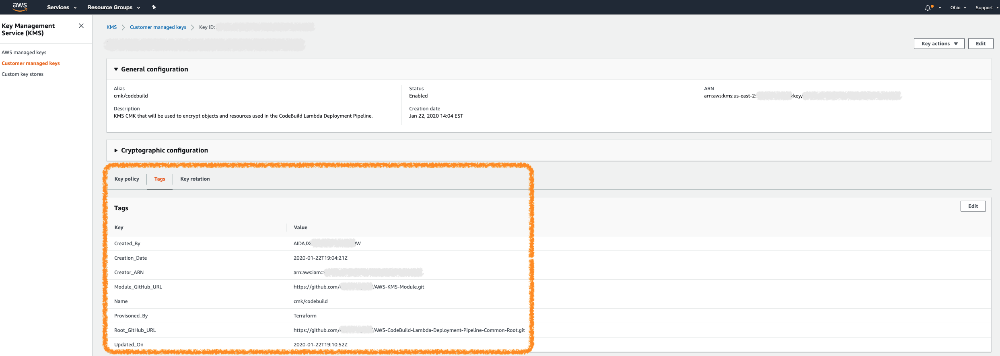

<!-- VSCode Markdown Exclusions-->
<!-- markdownlint-disable MD025 Single Title Headers-->
# Terraform KMS Key Module

  

<br>

# Getting Started

This Terraform module was created to quickly and easily provision a secure AWS Key Management Service (KMS) Customer Managed Key (CMK). CMK's are used for server-side encryption on AWS services such as S3 buckets, EBS volumes, Dynamo DB Tables, or any other service where data encryption is required. This module also includes optional variables that allow the consumer of the module to choose how KMS Key policies will be constructed and placed on be the CMK at the time of provisioning.

<br><br>

# Module Pre-Requisites and Dependencies

This module does not currently have any pre-requisites or dependency requirements.

<br><br>

# Module Usage

```terraform
module "kms" {
  source = "git@github.com:CloudMage-TF/AWS-KMS-Module?ref=v1.0.3"

  // Required Variables
  kms_key_description       = "KMS key provisioned to encrypt prod s3 bucket"
  kms_key_alias_name        = "prod/s3"
  
  // Optional Variables with module defined default values assigned
  # kms_owner_principal_list    = []
  # kms_admin_principal_list    = []
  # kms_user_principal_list     = []
  # kms_resource_principal_list = []
  
  // Tags
  # kms_tags                    = {
  #   Provisoned_By  = "Terraform"
  #   Module_GitHub_URL     = "https://github.com/CloudMage-TF/AWS-KMS-Module.git"
  # }
}
```

<br><br>

# Terraform Variables

Module variables that need to either be defined or re-defined with a non-default value can easily be hardcoded inline directly within the module call block or from within the root project that is consuming the module. If using the second approach then the root project must have it's own custom variables defined within the projects `variables.tf` file with set default values or with the values provided from a separate environmental `terraform.tfvar` file. Examples of both approaches can be found below. Note that for the standards used within this documentation, all variables will mostly use the first approach for ease of readability.

<br>

> __NOTE:__ There is also a third way to provide variable values using Terraform data sources. A data source is a unique type of code block used within a project that either instantiates or collects data that can be referenced throughout the project. A data source, for example,  can be declared to read the terraform state file and gather all of the available information from a previously deployed project stack. Any of the data contained within the data source can then be referenced to set the value of a project or module variable.

<br><br>

## Setting Variables Inline

```terraform
module "kms" {
  source = "git@github.com:CloudMage-TF/AWS-KMS-Module?ref=v1.0.3"

  // Required Variables
  kms_key_alias_name        = "prod/s3"
}
```

<br><br>

## Setting Variables in a Terraform Root Project

<br>

### Terraform Root Project/variables.tf

```terraform
variable "cmk_alias" {
  type        = string
  description = "Meaningful Description"
}
```

<br>

### Terraform Root Project/terraform.tfvars

```terraform
cmk_alias = "dev/ebs"
```

<br>

### Terraform Root Project/main.tf

```terraform
module "kms" {
  source = "git@github.com:CloudMage-TF/AWS-KMS-Module?ref=v1.0.3"

  // Required Variables
  kms_key_alias_name = var.cmk_alias
}
```

<br><br>

# Required Variables

The following required module variables do not contain default values and must be set by the consumer of the module to use the module successfully.

<br><br>

## :red_circle: kms_key_alias_name

<br>


<br>

This variable should be passed containing the desired key alias that will be assigned to the provisioned KMS CMK for its value.

 <br>

 > The required `alias/` prefix is already defined in the module and not required as part of the variable string.

<br><br>

### Declaration in module variables.tf

```terraform
variable "kms_key_alias_name" {
  type        = string
  description = "The alias that will be assigned to the provisioned KMS CMK. This value will be appended to alias/ within the module automatically."
}
```

<br><br>

### Module usage in project root main.tf

```terraform
module "kms" {
  source = "git@github.com:CloudMage-TF/AWS-KMS-Module?ref=v1.0.3"

  // Required Variables
  kms_key_alias_name        = "prod/s3"
}
```

<br><br><br>

## :red_circle: kms_key_description

<br>


<br>

This variable should be passed containing a short description of what the provisioned KMS CMK will be used for as its value.

<br><br>

### Declaration in module variables.tf

```terraform
variable "kms_key_description" {
  type        = string
  description = "The description that will be applied to the provisioned KMS Key."
}
```

<br><br>

### Module usage in project root main.tf

```terraform
module "kms" {
  source = "git@github.com:CloudMage-TF/AWS-KMS-Module?ref=v1.0.3"

  // Required Variables
  kms_key_alias_name        = "prod/s3"
  kms_key_description       = "KMS CMK used for encrypting all objects in the Prod S3 backup bucket."
}
```

<br><br><br>

## Base Module Execution

Once all of the modules required values have been assigned, then the module can be executed in its base capacity.

<br><br>

### Generated Key Policy

Without defining values for any optional module variables, a key policy with the following permissions will be created automatically and applied to the requested KMS CMK during module execution. Note that the module uses the `data "aws_caller_identity" "current" {}` data source to obtain the account id of the account that the root project was executed against and will use that value to automatically generate the root user ARN specified in the CMK Owner Policy.

```yaml
Statement:
  - Sid: "KMSKeyOwnerPolicy"
    Effect: Allow
    Principal:
      AWS:
        - "arn:aws:iam::123456789101:root"
      Action:
        - "kms:*"
      Resources: "*"
```

<br><br>

### Example `terraform plan` output

```terraform
Refreshing Terraform state in-memory prior to plan...
The refreshed state will be used to calculate this plan, but will not be
persisted to local or remote state storage.

data.aws_caller_identity.current: Refreshing state...
data.aws_iam_policy_document.kms_user_policy: Refreshing state...
data.aws_iam_policy_document.kms_admin_policy: Refreshing state...
data.aws_iam_policy_document.kms_resource_policy: Refreshing state...
data.aws_iam_policy_document.kms_owner_policy: Refreshing state...
data.aws_iam_policy_document.temp_kms_owner_kms_admin_merge_policy: Refreshing state...
data.aws_iam_policy_document.temp_kms_admin_kms_user_merge_policy: Refreshing state...
data.aws_iam_policy_document.this: Refreshing state...

------------------------------------------------------------------------

An execution plan has been generated and is shown below.
Resource actions are indicated with the following symbols:
  + create

Terraform will perform the following actions:

  # aws_kms_alias.this will be created
  + resource "aws_kms_alias" "this" {
      + arn            = (known after apply)
      + id             = (known after apply)
      + name           = "alias/prod/s3"
      + target_key_arn = (known after apply)
      + target_key_id  = (known after apply)
    }

  # aws_kms_key.this will be created
  + resource "aws_kms_key" "this" {
      + arn                     = (known after apply)
      + deletion_window_in_days = 30
      + description             = "KMS Key"
      + enable_key_rotation     = true
      + id                      = (known after apply)
      + is_enabled              = true
      + key_id                  = (known after apply)
      + key_usage               = (known after apply)
      + policy                  = jsonencode(
            {
              + Statement = [
                  + {
                      + Action    = "kms:*"
                      + Effect    = "Allow"
                      + Principal = {
                          + AWS = "arn:aws:iam::123456789101:root"
                        }
                      + Resource  = "*"
                      + Sid       = "KMSKeyOwnerPolicy"
                    },
                ]
              + Version   = "2012-10-17"
            }
        )
    }

Plan: 2 to add, 0 to change, 0 to destroy.

------------------------------------------------------------------------

Note: You didn't specify an "-out" parameter to save this plan, so Terraform
can't guarantee that exactly these actions will be performed if
"terraform apply" is subsequently run.
```

<br><br>

# Optional Variables

The following optional module variables are not required because they already have default values assigned when the variables where defined within the modules `variables.tf` file. If the default values do not need to be changed by the root project consuming the module, then they do not even need to be included in the root project. If any of the variables do need to be changed, then they can be added to the root project in the same way that the required variables were defined and utilized. Optional variables also may alter how the module provisions resources in the cases of encryption or IAM policy generation. A variable could flag an encryption requirement when provisioning an S3 bucket or Dynamo table by providing a KMS CMK, for example. Another use case may be the passage of ARN values to allow users or roles access to services or resources, whereas by default permissions would be more restrictive or only assigned to the account root or a single IAM role. A detailed explanation of each of this modules optional variables can be found below:

<br><br>

## :large_blue_circle: kms_owner_principal_list

<br>


<br>

This variable is used to define a list of users/roles that will be added to the KMS Key Owner policy statement. If the variable is not defined, then the key owner policy will be included to contain the account root user, allowing IAM the ability to assign key permissions using standard IAM policies. If a list of roles/users is defined, then the provided list will instead be used to determine the key owner principals. Typically this variable will only be used if the CMK will be shared, and the key provisioner needs to make another AWS account a key owner to allow IAM policies in the other account to define permission for the provisioned shared key.

<br>

> __Note:__ The key owner policy statement determines what users/roles own the provisioned KMS key. Owners have `kms:*` permissions on the CMK. They can perform any action on the key including performing any modifications to the key and the key policy.

<br><br>

### Declaration in module variables.tf

```terraform
variable "kms_owner_principal_list" {
  type        = list
  description = "List of users/roles/accounts that will own and have kms:* on the provisioned CMK."
  default     = []
}
```

<br>

> __Note:__ You can not assign an IAM group as a policy principal, only IAM users/roles are allowed as policy principals.

<br><br>

### Module usage in project root main.tf

```terraform
module "kms" {
  source = "git@github.com:CloudMage-TF/AWS-KMS-Module?ref=v1.0.3"

  // Required Variables
  kms_key_description       = "KMS CMK used for encrypting all objects in the Prod S3 backup bucket."
  kms_key_alias_name        = "prod/s3"
  kms_owner_principal_list  = ["arn:aws:iam::123456789101::root", "arn:aws:iam::109876543210::root"]
}
```

<br><br>

### Generated Key Policy

Without defining this variable a key policy with the following permissions will be created and applied to the requested KMS key:

```yaml
Statement:
  - Sid: "KMSKeyOwnerPolicy"
    Effect: Allow
    Principal:
      AWS:
        - "arn:aws:iam::123456789101:root"
      Action:
        - "kms:*"
      Resources: "*"
```

<br>

If a list defining any IAM users/roles/accounts is defined into the variable, a key policy with the following permissions will be created and applied to the requested KMS CMK:

```yaml
Statement:
  - Sid: "KMSKeyOwnerPolicy"
    Effect: Allow
    Principal:
      AWS:
        - "arn:aws:iam::123456789101:root"
        - "arn:aws:iam::109876543210:root"
      Action:
        - "kms:*"
      Resources: "*"
```

<br><br>

### Example `terraform plan` output

```terraform
Refreshing Terraform state in-memory prior to plan...
The refreshed state will be used to calculate this plan, but will not be
persisted to local or remote state storage.

data.aws_caller_identity.current: Refreshing state...
data.aws_iam_policy_document.kms_user_policy: Refreshing state...
data.aws_iam_policy_document.kms_resource_policy: Refreshing state...
data.aws_iam_policy_document.kms_admin_policy: Refreshing state...
data.aws_iam_policy_document.kms_owner_policy: Refreshing state...
data.aws_iam_policy_document.temp_kms_owner_kms_admin_merge_policy: Refreshing state...
data.aws_iam_policy_document.temp_kms_admin_kms_user_merge_policy: Refreshing state...
data.aws_iam_policy_document.this: Refreshing state...

------------------------------------------------------------------------

An execution plan has been generated and is shown below.
Resource actions are indicated with the following symbols:
  + create

Terraform will perform the following actions:

  # aws_kms_alias.this will be created
  + resource "aws_kms_alias" "this" {
      + arn            = (known after apply)
      + id             = (known after apply)
      + name           = "alias/prod/s3"
      + target_key_arn = (known after apply)
      + target_key_id  = (known after apply)
    }

  # aws_kms_key.this will be created
  + resource "aws_kms_key" "this" {
      + arn                     = (known after apply)
      + deletion_window_in_days = 30
      + description             = "KMS Key"
      + enable_key_rotation     = true
      + id                      = (known after apply)
      + is_enabled              = true
      + key_id                  = (known after apply)
      + key_usage               = (known after apply)
      + policy                  = jsonencode(
            {
              + Statement = [
                  + {
                      + Action    = "kms:*"
                      + Effect    = "Allow"
                      + Principal = {
                          + AWS = [
                            "arn:aws:iam::123456789101:root",
                            "arn:aws:iam::109876543210:root"
                          ]
                      + Resource  = "*"
                      + Sid       = "KMSKeyOwnerPolicy"
                    }
                  }
                ]
              + Version   = "2012-10-17"
            }
        )
    }

Plan: 2 to add, 0 to change, 0 to destroy.

------------------------------------------------------------------------

Note: You didn't specify an "-out" parameter to save this plan, so Terraform
can't guarantee that exactly these actions will be performed if
"terraform apply" is subsequently run.
```

<br><br><br>

## :large_blue_circle: kms_admin_principal_list

<br>


<br>

This variable is used to define a list of users/roles that will be added to the KMS Key Administrator policy statement block. If a list of roles/users (including a list of a single user or role) is provided, then a KMS key Administrator policy will be generated automatically and appended to the key policy that will be applied to the provisioned CMK. If this variable is left empty or not included in the module call, then the KMS key administrator policy statement **will not be included** in the KMS key policy. The account root owner will still have kms:* permissions, but no additional administrators will be added. IAM policies can be constructed post key creation in order to grant permissions, including administration permissions to users/roles later by the key owner.

<br>

> __Note:__ The key administrator policy statement determines what users/roles have administrative rights on the provisioned KMS key. Key administrators can modify the key and the key policy, but they are not granted usage of the key, or the ability to manage grants for the key. If a key administrator requires usage permissions, then they would also need to be added to the key usage policy statement.

<br><br>

### Declaration in module variables.tf

```terraform
variable "kms_admin_principal_list" {
  type        = list
  description = "List of users/roles that will be key administrators of the provisioned KMS CMK."
  default     = []
}
```

<br>

> __Note:__ You can not assign an IAM group as a policy principal, only IAM users/roles are allowed as policy principals.

<br><br>

### Module usage in project root main.tf

```terraform
module "kms" {
  source = "git@github.com:CloudMage-TF/AWS-KMS-Module?ref=v1.0.3"

  // Required Variables
  kms_key_description       = "KMS CMK used for encrypting all objects in the Prod S3 backup bucket."
  kms_key_alias_name        = "prod/s3"
  kms_admin_principal_list  = ["arn:aws:iam::123456789101:role/AWS-KMS-Admin-Role"]

  // Optional Variables with module defined default values assigned
  # kms_owner_principal_list    = []
}
```

<br><br>

### Generated Key Policy

If a list defining any IAM users/roles is defined into the variable, a key policy with the following permissions will be created and applied to the requested KMS CMK:

```yaml
Statement:
  - Sid: "KMSKeOwnerPolicy"
    Effect: Allow
    Principal:
      AWS:
        - "arn:aws:iam::123456789101:role/AWS-KMS-Admin-Role"
        - "arn:aws:iam::123456789101:user/kms_admin"
      Action:
        - "kms:Create*"
        - "kms:Describe*"
        - "kms:Enable*"
        - "kms:List*"
        - "kms:Put*"
        - "kms:Update*"
        - "kms:Revoke*"
        - "kms:Disable*"
        - "kms:Get*"
        - "kms:Delete*"
        - "kms:TagResource"
        - "kms:UntagResource"
        - "kms:ScheduleKeyDeletion"
        - "kms:CancelKeyDeletion"
      Resources: "*"
```

<br><br>

### Example `terraform plan` output

```terraform
Refreshing Terraform state in-memory prior to plan...
The refreshed state will be used to calculate this plan, but will not be
persisted to local or remote state storage.

data.aws_caller_identity.current: Refreshing state...
data.aws_iam_policy_document.kms_user_policy: Refreshing state...
data.aws_iam_policy_document.kms_resource_policy: Refreshing state...
data.aws_iam_policy_document.kms_admin_policy: Refreshing state...
data.aws_iam_policy_document.kms_owner_policy: Refreshing state...
data.aws_iam_policy_document.temp_kms_owner_kms_admin_merge_policy: Refreshing state...
data.aws_iam_policy_document.temp_kms_admin_kms_user_merge_policy: Refreshing state...
data.aws_iam_policy_document.this: Refreshing state...

------------------------------------------------------------------------

An execution plan has been generated and is shown below.
Resource actions are indicated with the following symbols:
  + create

Terraform will perform the following actions:

  # aws_kms_alias.this will be created
  + resource "aws_kms_alias" "this" {
      + arn            = (known after apply)
      + id             = (known after apply)
      + name           = "alias/prod/s3"
      + target_key_arn = (known after apply)
      + target_key_id  = (known after apply)
    }

  # aws_kms_key.this will be created
  + resource "aws_kms_key" "this" {
      + arn                     = (known after apply)
      + deletion_window_in_days = 30
      + description             = "KMS Key"
      + enable_key_rotation     = true
      + id                      = (known after apply)
      + is_enabled              = true
      + key_id                  = (known after apply)
      + key_usage               = (known after apply)
      + policy                  = jsonencode(
            {
              + Statement = [
                  + {
                      + Action    = "kms:*"
                      + Effect    = "Allow"
                      + Principal = {
                          + AWS = "arn:aws:iam::123456789101:root"
                        }
                      + Resource  = "*"
                      + Sid       = "KMSKeyOwnerPolicy"
                    },
                  + {
                      + Action    = [
                          + "kms:Update*",
                          + "kms:UntagResource",
                          + "kms:TagResource",
                          + "kms:ScheduleKeyDeletion",
                          + "kms:Revoke*",
                          + "kms:Put*",
                          + "kms:List*",
                          + "kms:Get*",
                          + "kms:Enable*",
                          + "kms:Disable*",
                          + "kms:Describe*",
                          + "kms:Delete*",
                          + "kms:Create*",
                          + "kms:CancelKeyDeletion",
                        ]
                      + Effect    = "Allow"
                      + Principal = {
                          + AWS = "arn:aws:iam::123456789101:role/AWS-KMS-Admin-Role"
                        }
                      + Resource  = "*"
                      + Sid       = "KMSKeyAdministrationPolicy"
                    },
                ]
              + Version   = "2012-10-17"
            }
        )
    }

Plan: 2 to add, 0 to change, 0 to destroy.

------------------------------------------------------------------------

Note: You didn't specify an "-out" parameter to save this plan, so Terraform
can't guarantee that exactly these actions will be performed if
"terraform apply" is subsequently run.
```

<br><br><br>

## :large_blue_circle: kms_user_principal_list

<br>


<br>

This variable is used to define a list of users/roles that will be added to the KMS Key usage policy statement block. If a list of roles/users (including a list of a single user or role) is provided, then a KMS key usage policy will be generated automatically and appended to the key policy that will be applied to the provisioned CMK. If this variable is left empty or not included in the module call, then the KMS key usage policy statement **will not be included** in the KMS key policy. The account root owner will still have kms:* permissions, but no additional key users will be added. IAM policies can be constructed post key creation in order to grant permissions, including key usage permissions to users/roles later by the key owner or a key administrator.

<br>

> __Note:__ The key usage policy statement determines what users/roles have rights to encrypt, decrypt, re-encrypt, and generate data key operations with the provisioned CMK. Any users/roles that are included in this policy statement have no other rights on the key unless they are also added to one of the other key policy statement blocks also.

<br><br>

### Declaration in module variables.tf

```terraform
variable "kms_user_principal_list" {
  type        = list
  description = "List of users/roles that will be granted usage of the provisioned KMS CMK."
  default     = []
}
```

<br>

> __Note:__ You can not assign an IAM group as a policy principal, only IAM users/roles are allowed as policy principals.

<br><br>

### Module usage in project root main.tf

```terraform
module "kms" {
  source = "git@github.com:CloudMage-TF/AWS-KMS-Module?ref=v1.0.3"

  // Required Variables
  kms_key_description       = "KMS CMK used for encrypting all objects in the Prod S3 backup bucket."
  kms_key_alias_name        = "prod/s3"
  kms_admin_principal_list  = ["arn:aws:iam::123456789101:role/AWS-KMS-Admin-Role"]
  kms_user_principal_list   = ["arn:aws:iam::123456789101:role/AWS-RDS-Service-Role", "arn:aws:iam::123456789101:user/rnason"]
  
  // Optional Variables with module defined default values assigned
  # kms_owner_principal_list  = []
}
```

<br><br>

### Generated Key Policy

If a list defining any IAM users/roles is defined into the variable, a key policy with the following permissions will be created and applied to the requested KMS CMK:

```yaml
Statement:
  - Sid: "KMSKeyUserPolicy"
    Effect: Allow
    Principal:
      AWS:
        - "arn:aws:iam::123456789101:role/AWS-RDS-Service-Role"
        - "arn:aws:iam::123456789101:user/rnason"
      Action:
        - "kms:DescribeKey"
        - "kms:GenerateDataKey*"
        - "kms:Encrypt"
        - "kms:ReEncrypt*"
        - "kms:Decrypt"
      Resources: "*"
```

<br><br>

### Example `terraform plan` output

```terraform
Refreshing Terraform state in-memory prior to plan...
The refreshed state will be used to calculate this plan, but will not be
persisted to local or remote state storage.

data.aws_caller_identity.current: Refreshing state...
data.aws_iam_policy_document.kms_user_policy: Refreshing state...
data.aws_iam_policy_document.kms_resource_policy: Refreshing state...
data.aws_iam_policy_document.kms_admin_policy: Refreshing state...
data.aws_iam_policy_document.kms_owner_policy: Refreshing state...
data.aws_iam_policy_document.temp_kms_owner_kms_admin_merge_policy: Refreshing state...
data.aws_iam_policy_document.temp_kms_admin_kms_user_merge_policy: Refreshing state...
data.aws_iam_policy_document.this: Refreshing state...

------------------------------------------------------------------------

An execution plan has been generated and is shown below.
Resource actions are indicated with the following symbols:
  + create

Terraform will perform the following actions:

  # aws_kms_alias.this will be created
  + resource "aws_kms_alias" "this" {
      + arn            = (known after apply)
      + id             = (known after apply)
      + name           = "alias/prod/s3"
      + target_key_arn = (known after apply)
      + target_key_id  = (known after apply)
    }

  # aws_kms_key.this will be created
  + resource "aws_kms_key" "this" {
      + arn                     = (known after apply)
      + deletion_window_in_days = 30
      + description             = "KMS Key"
      + enable_key_rotation     = true
      + id                      = (known after apply)
      + is_enabled              = true
      + key_id                  = (known after apply)
      + key_usage               = (known after apply)
      + policy                  = jsonencode(
            {
              + Statement = [
                  + {
                      + Action    = "kms:*"
                      + Effect    = "Allow"
                      + Principal = {
                          + AWS = "arn:aws:iam::123456789101:root"
                        }
                      + Resource  = "*"
                      + Sid       = "KMSKeyOwnerPolicy"
                    },
                  + {
                      + Action    = [
                          + "kms:Update*",
                          + "kms:UntagResource",
                          + "kms:TagResource",
                          + "kms:ScheduleKeyDeletion",
                          + "kms:Revoke*",
                          + "kms:Put*",
                          + "kms:List*",
                          + "kms:Get*",
                          + "kms:Enable*",
                          + "kms:Disable*",
                          + "kms:Describe*",
                          + "kms:Delete*",
                          + "kms:Create*",
                          + "kms:CancelKeyDeletion",
                        ]
                      + Effect    = "Allow"
                      + Principal = {
                          + AWS = "arn:aws:iam::123456789101:role/AWS-KMS-Admin-Role"
                        }
                      + Resource  = "*"
                      + Sid       = "KMSKeyAdministrationPolicy"
                    },
                  + {
                      + Action    = [
                          + "kms:ReEncrypt*",
                          + "kms:GenerateDataKey*",
                          + "kms:Encrypt",
                          + "kms:DescribeKey",
                          + "kms:Decrypt",
                        ]
                      + Effect    = "Allow"
                      + Principal = {
                          + AWS = [
                            "arn:aws:iam::123456789101:role/AWS-RDS-Service-Role",
                            "arn:aws:iam::123456789101:user/rnason"
                          ]
                        }
                      + Resource  = "*"
                      + Sid       = "KMSKeyUserPolicy"
                    },
                ]
              + Version   = "2012-10-17"
            }
        )
    }

Plan: 2 to add, 0 to change, 0 to destroy.

------------------------------------------------------------------------

Note: You didn't specify an "-out" parameter to save this plan, so Terraform
can't guarantee that exactly these actions will be performed if
"terraform apply" is subsequently run.
```

<br><br><br>

## :large_blue_circle: kms_resource_principal_list

<br>


<br>

This variable is used to define a list of users/roles that will be added to the KMS Key resource grant policy statement block. If a list of roles/users (including a list of a single user or role) is provided, then a KMS key resource grant policy will be generated automatically and appended to the key policy that will be applied to the provisioned CMK. If this variable is left empty or not included in the module call, then the KMS key resource grant policy statement **will not be included** in the KMS key policy. The account root owner will still have kms:* permissions, but no additional key resource grant permissions will be added. IAM policies can be constructed post key creation in order to grant permissions, including key grantee permissions to users/roles later by the key owner or a key administrator.

<br>

> __Note:__ The key resource grant policy statement determines what users/roles have rights to list, create, and revoke grants on the provisioned CMK. Key grants are a way of providing usage of the CMK temporarily. A user/role that has key grant or resource rights is allowed to grant applications, services, or resources a limited time pass to use the CMK and then revoke that pass when the application, service, or resource has completed the operation that required access to the key. No other rights on the key are given unless the user/role is also added to one of the other key policy statement blocks also.

<br><br>

### Declaration in module variables.tf

```terraform
variable "kms_resource_principal_list" {
  type        = list
  description = "List of users/roles that will be granted permissions to create/list/delete temporary grants to the provisioned KMS CMK."
  default     = []
}
```

<br>

> __Note:__ You can not assign an IAM group as a policy principal, only IAM users/roles are allowed as policy principals.

<br><br>

### Module usage in project root main.tf

```terraform
module "kms" {
  source = "git@github.com:CloudMage-TF/AWS-KMS-Module?ref=v1.0.3"

  // Required Variables
  kms_key_description         = "KMS CMK used for encrypting all objects in the Prod S3 backup bucket."
  kms_key_alias_name          = "prod/s3"
  kms_admin_principal_list    = ["arn:aws:iam::123456789101:role/AWS-KMS-Admin-Role"]
  kms_user_principal_list     = ["arn:aws:iam::123456789101:role/AWS-RDS-Service-Role", "arn:aws:iam::123456789101:user/rnason"]
  kms_resource_principal_list = ["arn:aws:iam::123456789101:role/AWS-RDS-Service-Role", "arn:aws:iam::123456789101:user/rnason"]
  
  // Optional Variables with module defined default values assigned
  # kms_owner_principal_list  = []
}
```

<br><br>

### Generated Key Policy

If a list defining any IAM users/roles is defined in the variable, a key policy with the following permissions will be created and applied to the requested KMS CMK:

```yaml
Statement:
  - Sid: "KMSKeyGrantPolicy"
    Effect: Allow
    Principal:
      AWS:
        - "arn:aws:iam::123456789101:role/AWS-RDS-Service-Role"
        - "arn:aws:iam::123456789101:user/rnason"
      Action:
        - "kms:ListGrants"
        - "kms:CreateGrant"
        - "kms:RevokeGrant"
      Resources: "*"
      Condition: {
        "Bool": {
          "kms:GrantIsForAWSResource: "true"
        }
      }
```

<br><br>

### Example `terraform plan` output

```terraform
Refreshing Terraform state in-memory prior to plan...
The refreshed state will be used to calculate this plan, but will not be
persisted to local or remote state storage.

data.aws_caller_identity.current: Refreshing state...
data.aws_iam_policy_document.kms_user_policy: Refreshing state...
data.aws_iam_policy_document.kms_admin_policy: Refreshing state...
data.aws_iam_policy_document.kms_resource_policy: Refreshing state...
data.aws_iam_policy_document.kms_owner_policy: Refreshing state...
data.aws_iam_policy_document.temp_kms_owner_kms_admin_merge_policy: Refreshing state...
data.aws_iam_policy_document.temp_kms_admin_kms_user_merge_policy: Refreshing state...
data.aws_iam_policy_document.this: Refreshing state...

------------------------------------------------------------------------

An execution plan has been generated and is shown below.
Resource actions are indicated with the following symbols:
  + create

Terraform will perform the following actions:

  # aws_kms_alias.this will be created
  + resource "aws_kms_alias" "this" {
      + arn            = (known after apply)
      + id             = (known after apply)
      + name           = "alias/prod/s3"
      + target_key_arn = (known after apply)
      + target_key_id  = (known after apply)
    }

  # aws_kms_key.this will be created
  + resource "aws_kms_key" "this" {
      + arn                     = (known after apply)
      + deletion_window_in_days = 30
      + description             = "KMS Key"
      + enable_key_rotation     = true
      + id                      = (known after apply)
      + is_enabled              = true
      + key_id                  = (known after apply)
      + key_usage               = (known after apply)
      + policy                  = jsonencode(
            {
              + Statement = [
                  + {
                      + Action    = "kms:*"
                      + Effect    = "Allow"
                      + Principal = {
                          + AWS = "arn:aws:iam::123456789101:root"
                        }
                      + Resource  = "*"
                      + Sid       = "KMSKeyOwnerPolicy"
                    },
                  + {
                      + Action    = [
                          + "kms:Update*",
                          + "kms:UntagResource",
                          + "kms:TagResource",
                          + "kms:ScheduleKeyDeletion",
                          + "kms:Revoke*",
                          + "kms:Put*",
                          + "kms:List*",
                          + "kms:Get*",
                          + "kms:Enable*",
                          + "kms:Disable*",
                          + "kms:Describe*",
                          + "kms:Delete*",
                          + "kms:Create*",
                          + "kms:CancelKeyDeletion",
                        ]
                      + Effect    = "Allow"
                      + Principal = {
                          + AWS = "arn:aws:iam::123456789101:role/AWS-KMS-Admin-Role"
                        }
                      + Resource  = "*"
                      + Sid       = "KMSKeyAdministrationPolicy"
                    },
                  + {
                      + Action    = [
                          + "kms:ReEncrypt*",
                          + "kms:GenerateDataKey*",
                          + "kms:Encrypt",
                          + "kms:DescribeKey",
                          + "kms:Decrypt",
                        ]
                      + Effect    = "Allow"
                      + Principal = {
                          + AWS = [
                            "arn:aws:iam::123456789101:role/AWS-RDS-Service-Role",
                            "arn:aws:iam::123456789101:user/rnason"
                          ]
                        }
                      + Resource  = "*"
                      + Sid       = "KMSKeyUserPolicy"
                    },
                  + {
                      + Action    = [
                          + "kms:RevokeGrant",
                          + "kms:ListGrants",
                          + "kms:CreateGrant",
                        ]
                      + Condition = {
                          + Bool = {
                              + kms:GrantIsForAWSResource = [
                                  + "true",
                                ]
                            }
                        }
                      + Effect    = "Allow"
                      + Principal = {
                          + AWS = [
                            "arn:aws:iam::123456789101:role/AWS-RDS-Service-Role",
                            "arn:aws:iam::123456789101:user/rnason"
                          ]
                        }
                      + Resource  = "*"
                      + Sid       = "KMSKeyGrantPolicy"
                    },
                ]
              + Version   = "2012-10-17"
            }
        )
    }

Plan: 2 to add, 0 to change, 0 to destroy.

------------------------------------------------------------------------

Note: You didn't specify an "-out" parameter to save this plan, so Terraform
can't guarantee that exactly these actions will be performed if
"terraform apply" is subsequently run.
```

<br><br><br>

## :large_blue_circle: kms_tags

<br>


<br>

This variable should contain a map of tags that will be assigned to the KMS CMK upon creation. Any tags contained within the `kms_tags` map variable will be passed to the module and automatically merged with a few tags that are also automatically created when the module is executed. The automatically generated tags are as follows:

- __Name__ - This tag is assigned the value from the `kms_key_alias_name` required variable that is passed during module execution
- __Created_By__ - This tag is assigned the value of the aws user that was used to execute the Terraform module to create the KMS CMK. It uses the Terraform `aws_caller_identity {}` data source provider to obtain the User_Id value. This tag will be ignored for any future executions of the module, ensuring that its value will not be changed after it's initial creation.
- __Creator_ARN__ - This tag is assigned the ARN value of the aws user that was used to execute the Terraform module to create the KMS CMK. It uses the Terraform `aws_caller_identity {}` data source provider to obtain the User_ARN value. This tag will be ignored for any future executions of the module, ensuring that its value will not be changed after it's initial creation.
- __Creation_Date__ - This tag is assigned a value that is obtained by the Terraform `timestamp()` function. This tag will be ignored for any future executions of the module, ensuring that its value will not be changed after it's initial creation.
- __Updated_On__ - This tag is assigned a value that is obtained by the Terraform `timestamp()` function. This tag will be updated on each future execution of the module to ensure that it's value displays the last `terraform apply` date.

<br><br>

### Declaration in module variables.tf

```terraform
variable "kms_tags" {
  type        = map
  description = "Specify any tags that should be added to the KMS CMK being provisioned."
  default     = {
    Provisoned_By  = "Terraform"
    Module_GitHub_URL     = "https://github.com/CloudMage-TF/AWS-KMS-Module.git"
  }
}
```

<br><br>



<br><br>

### Module usage in project root main.tf

```terraform
module "kms" {
  source = "git@github.com:CloudMage-TF/AWS-KMS-Module?ref=v1.0.3"

  // Required Variables
  kms_key_description         = "KMS CMK used for encrypting all objects in the Prod S3 backup bucket."
  kms_key_alias_name          = "prod/s3"
  
  // Tags
  kms_tags = {
     Provisoned_By  = "Terraform"
     Module_GitHub_URL     = "https://github.com/CloudMage-TF/AWS-KMS-Module.git"
     Environment    = "Prod"
   }
  
  // Optional Variables with module defined default values assigned
  # kms_owner_principal_list    = []
  # kms_admin_principal_list    = []
  # kms_user_principal_list     = []
  # kms_resource_principal_list = []
}
```

<br><br>

# Module Example Usage

An example of how to use this module can be found within the `example` directory of this repository

<br><br>

# Variables and TFVars File Templates

The following code block can be used or appended to an existing tfvars file within the project root consuming this module. Optional Variables are commented out and have their values set to the default values defined in the modules variables.tf file. If the values do not need to be changed, then they do not need to be redefined in the project root. If they do need to be changed, then include them in the root project and change the values accordingly.

<br><br>

## Complete Module variables.tf File

```terraform
###########################################################################
# Required KMS CMK Module Vars:                                           #
#-------------------------------------------------------------------------#
# The following variables require consumer defined values to be provided. #
###########################################################################
variable "kms_key_description" {
  type        = string
  description = "The description that will be applied to the provisioned KMS Key."
}
variable "kms_key_alias_name" {
  type        = string
  description = "The alias that will be assigned to the provisioned KMS CMK. This value will be appended to alias/ within the module automatically."
}


###########################################################################
# Optional KMS CMK Module Vars:                                           #
#-------------------------------------------------------------------------#
# The following variables have default values already set by the module.  #
# They will not need to be included in a project root module variables.tf #
# file unless a non-default value needs be assigned to the variable.      #
###########################################################################
variable "kms_owner_principal_list" {
  type        = list
  description = "List of users/roles/accounts that will own and have kms:* on the provisioned CMK."
  default     = []
}

variable "kms_admin_principal_list" {
  type        = list
  description = "List of users/roles that will be key administrators of the provisioned KMS CMK"
  default     = []
}

variable "kms_user_principal_list" {
  type        = list
  description = "List of users/roles that will be granted usage of the provisioned KMS CMK."
  default     = []
}

variable "kms_resource_principal_list" {
  type        = list
  description = "List of users/roles that will be granted permissions to create/list/delete temporary grants to the provisioned KMS CMK."
  default     = []
}

variable "kms_tags" {
  type        = map
  description = "Specify any tags that should be added to the KMS CMK being provisioned."
  default     = {
    Provisoned_By  = "Terraform"
    Module_GitHub_URL     = "https://github.com/CloudMage-TF/AWS-KMS-Module.git"
  }
}
```

<br><br>

## Complete Module TFVars File

```terraform
###########################################################################
# Required KMS CMK Module Vars:                                           #
#-------------------------------------------------------------------------#
# The following variables require consumer defined values to be provided. #
###########################################################################
kms_key_description          = "Value Required"
kms_key_alias_name           = "value/required"


###########################################################################
# Optional KMS CMK Module Vars:                                           #
#-------------------------------------------------------------------------#
# The following variables have default values already set by the module.  #
# They will not need to be included in a project root module variables.tf #
# file unless a non-default value needs be assigned to the variable.      #
###########################################################################
kms_owner_principal_list    = []
kms_admin_principal_list    = []
kms_user_principal_list     = []
kms_resource_principal_list = []

kms_tags        = {
    Provisoned_By  = "Terraform"
    Module_GitHub_URL     = "https://github.com/CloudMage-TF/AWS-KMS-Module.git"
}
```

<br><br>

# Module Outputs

The template will finally create the following outputs that can be pulled and used in subsequent terraform runs via data sources. The outputs will be written to the Terraform state file.

<br>

```terraform
######################
# KMS Key Outputs:   #
######################
output "kms_key_id" {}
output "kms_key_arn" {}
output "kms_key_alias" {}
```

<br><br>

# Module Output Usage

When using and calling the module within a root project, the output values of the module are available to the project root by simply referencing the module outputs from the root project `outputs.tf` file.

<br>

```terraform
######################
# KMS Key Outputs:   #
######################
output "cmk_id" {
  value = module.kms.kms_key_id
}

output "cmk_arn" {
  value = module.kms.kms_key_arn
}

output "cmk_alias" {
  value = module.kms.kms_key_alias
}
```

<br>

> __Note:__ When referencing the module outputs be sure that the output value contains the identifier given to the module call. As an example if the module was defined as `module "demo_cmk" {}` then the output reference would be constructed as `module.demo_cmk.kms_key_arn`.

<br><br>

# Requirements

- [Terraform](https://www.terraform.io/)
- [GIT](https://git-scm.com/download/win)
- [AWS-Account](https://https://aws.amazon.com/)

<br><br>

# Recommended

- [Terraform for VSCode](https://github.com/mauve/vscode-terraform)
- [Terraform Config Inspect](https://github.com/hashicorp/terraform-config-inspect)

<br><br>

# Contacts and Contributions

This project is owned by [CloudMage](rnason@cloudmage.io).

To contribute, please:

- Fork the project
- Create a local branch
- Submit Changes
- Create A Pull Request
